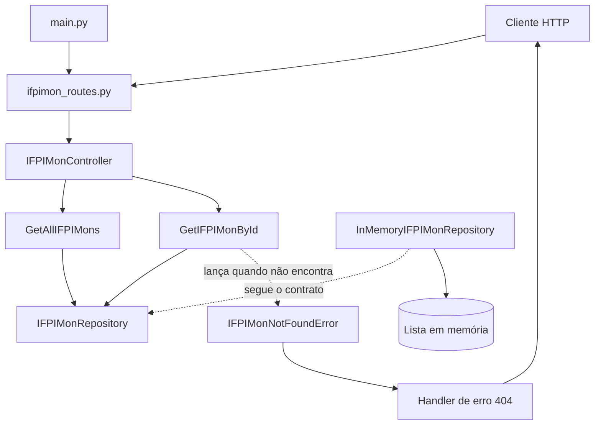

# Arquitetura atual da IFPI Mon API

Este documento descreve apenas a arquitetura que está implementada atualmente.
A API oferece duas consultas de IFPI Mons, utiliza dados em memória e possui
tratamento centralizado para o erro de recurso não encontrado.

Para aprender a consumir as rotas disponíveis, consulte
[Funcionamento da API](funcionamento.md).

## Estado atual

Já estão implementados:

- aplicação FastAPI;
- rota raiz com informações básicas;
- listagem de todos os IFPI Mons;
- busca de um IFPI Mon por ID;
- schema Pydantic do IFPI Mon;
- contrato de repository;
- repository em memória com um dado mockado;
- casos de uso de listagem e busca por ID;
- controller de IFPI Mons;
- composição das dependências;
- exceção e handler para IFPI Mon não encontrado.

Ainda não estão implementados:

- criação, atualização ou exclusão de IFPI Mons;
- banco de dados externo;
- autenticação e autorização;
- services;
- testes automatizados.

## Estrutura do código

```text
api/
├── __init__.py
├── main.py
├── dependencies.py
├── controllers/
│   ├── __init__.py
│   └── ifpimon_controller.py
├── exceptions/
│   ├── __init__.py
│   ├── handlers.py
│   ├── ifpimon_exceptions.py
│   └── tutorial.md
├── repositories/
│   ├── __init__.py
│   ├── ifpimon_repository.py
│   └── in_memory_ifpimon_repository.py
├── routes/
│   ├── __init__.py
│   ├── ifpimon_routes.py
│   └── root_routes.py
├── schemas/
│   ├── __init__.py
│   └── ifpimon_schema.py
├── services/
│   └── __init__.py
└── usecases/
    ├── get_all_ifpimons.py
    └── get_ifpimon_by_id.py
```

Os arquivos `__init__.py` identificam as pastas como pacotes Python e permitem
imports consistentes, como `from api.routes...`.

## Fluxo entre as camadas



## `main.py`: inicialização da aplicação

O arquivo `api/main.py`:

1. cria a instância de `FastAPI`;
2. registra os exception handlers;
3. inclui a rota raiz;
4. inclui as rotas de IFPI Mons com o prefixo `/api`.

Trecho correspondente à configuração atual:

```python
app = FastAPI()
register_exception_handlers(app)

app.include_router(ifpimon_root_router)
app.include_router(
    ifpimon_routes,
    prefix="/api",
)
```

O prefixo `/api` do `main.py` é combinado com o prefixo `/ifpimons` do router.
Por isso, os endpoints finais começam com `/api/ifpimons`.

## `dependencies.py`: composição dos objetos

O arquivo `api/dependencies.py` cria e conecta as instâncias utilizadas pela
aplicação:

```text
InMemoryIFPIMonRepository
            ↓
GetAllIFPIMons e GetIFPIMonById
            ↓
IFPIMonController
```

A ordem atual é equivalente a:

```python
repository = InMemoryIFPIMonRepository()

get_all_use_case = GetAllIFPIMons(repository)
get_by_id = GetIFPIMonById(repository)

ifpimon_controller = IFPIMonController(
    get_all_use_case,
    get_by_id,
)
```

O repository é instanciado uma única vez. Assim, todas as consultas realizadas
durante a execução utilizam a mesma lista em memória.

## Routes: entrada HTTP

O arquivo `api/routes/ifpimon_routes.py` possui um `APIRouter` com o prefixo
`/ifpimons` e duas operações:

```text
GET /api/ifpimons
GET /api/ifpimons/{ifpimon_id}
```

As funções recebem os dados da URL e chamam o controller:

```python
@router.get("")
def get_all_ifpimons():
    return ifpimon_controller.get_all_execute()


@router.get("/{ifpimon_id}")
def get_ifpimon_by_id(ifpimon_id: int):
    return ifpimon_controller.get_by_id_execute(ifpimon_id)
```

A route não consulta a lista em memória e não executa a regra de recurso não
encontrado.

O arquivo `api/routes/root_routes.py` implementa `GET /`, que apresenta o nome
da API, o endereço da documentação e referências para as consultas.

## Controller: coordenação das operações

`IFPIMonController` recebe os dois casos de uso em seu construtor:

```text
GetAllIFPIMons
GetIFPIMonById
```

Ele oferece um método para cada operação:

```python
def get_all_execute(self) -> list[IFPIMonSchema]:
    return self.get_all_UseCase.execute()


def get_by_id_execute(self, ifpimon_id: int) -> IFPIMonSchema:
    return self.get_ifpimon_by_id_UseCase.execute(ifpimon_id)
```

O controller não conhece o armazenamento em memória nem cria respostas HTTP.

## Use cases: ações disponíveis

### `GetAllIFPIMons`

Representa a ação de listar todos os IFPI Mons:

```python
def execute(self) -> list[IFPIMonSchema]:
    return self.repository.get_all()
```

Uma listagem sempre devolve uma lista. Se não houver registros, o resultado deve
ser `[]`, e não `None`.

### `GetIFPIMonById`

Representa a ação de buscar um IFPI Mon pelo identificador:

```python
def execute(self, ifpimon_id: int) -> IFPIMonSchema:
    ifpimon = self.repository.get_by_id(ifpimon_id)

    if ifpimon is None:
        raise IFPIMonNotFoundError(ifpimon_id)

    return ifpimon
```

O use case recebe o ID em `execute()`, consulta o contrato do repository e lança
uma exceção da aplicação quando o item não existe.

## Repository: contrato e implementação

### Contrato

`IFPIMonRepository` é um `Protocol` que define as operações exigidas:

```python
class IFPIMonRepository(Protocol):
    def get_by_id(
        self,
        ifpimon_id: int,
    ) -> IFPIMonSchema | None:
        ...

    def get_all(self) -> list[IFPIMonSchema]:
        ...
```

Os casos de uso dependem desse contrato, não diretamente de
`InMemoryIFPIMonRepository`. Uma implementação futura poderá consultar um banco
real desde que ofereça as mesmas operações.

### Implementação em memória

`InMemoryIFPIMonRepository` mantém uma lista criada em seu construtor. O dado
mockado atual é:

```json
{
  "id": 1,
  "nome": "Celtinha",
  "tipo": "Metal",
  "treinador": "Vitor"
}
```

`get_all()` devolve a lista e `get_by_id()` procura o primeiro objeto cujo ID é
igual ao valor recebido. Se não encontrar, `get_by_id()` devolve `None`.

Os dados são voláteis: eles existem enquanto o processo da API estiver ativo e
voltam ao estado inicial quando o servidor reinicia.

## Schema atual

`IFPIMonSchema` é um modelo Pydantic com quatro campos:

```python
class IFPIMonSchema(BaseModel):
    id: int
    nome: str
    tipo: str
    treinador: str | None = None
```

`treinador` aceita texto ou `None`. Como possui `= None`, ele pode ser omitido ao
criar um objeto.

## Exceptions e handler

`IFPIMonNotFoundError` guarda o ID que não foi encontrado:

```python
class IFPIMonNotFoundError(Exception):
    def __init__(self, ifpimon_id: int):
        self.ifpimon_id = ifpimon_id
```

O handler registrado converte essa exceção em uma resposta JSON com status 404:

```json
{
  "error": "ifpimon_not_found",
  "message": "IFPI Mon com ID 999 não foi encontrado."
}
```

Não existe `try/except` nas routes ou no controller para esse fluxo. O FastAPI
captura a exceção lançada pelo use case e executa o handler registrado no
`main.py`.

## Responsabilidades atuais

| Componente | Responsabilidade implementada |
|---|---|
| `main.py` | Iniciar o FastAPI, handlers e routers |
| `dependencies.py` | Instanciar repository, use cases e controller |
| Routes | Receber a requisição e chamar o controller |
| Controller | Encaminhar a operação ao use case correto |
| Use cases | Executar listagem e busca por ID |
| Repository | Ler os dados mockados em memória |
| Schema | Definir e validar a estrutura de um IFPI Mon |
| Exception | Representar que um ID não foi encontrado |
| Handler | Transformar a exceção em resposta HTTP 404 |
| Services | Nenhuma responsabilidade implementada ainda |

## Limitações atuais

- existe apenas um IFPI Mon mockado;
- os dados não sobrevivem à reinicialização;
- a API oferece somente operações de leitura;
- as routes ainda não declaram `response_model`;
- não existe paginação, filtro ou pesquisa;
- não existem testes automatizados;
- erros de validação continuam usando o formato padrão do FastAPI.
