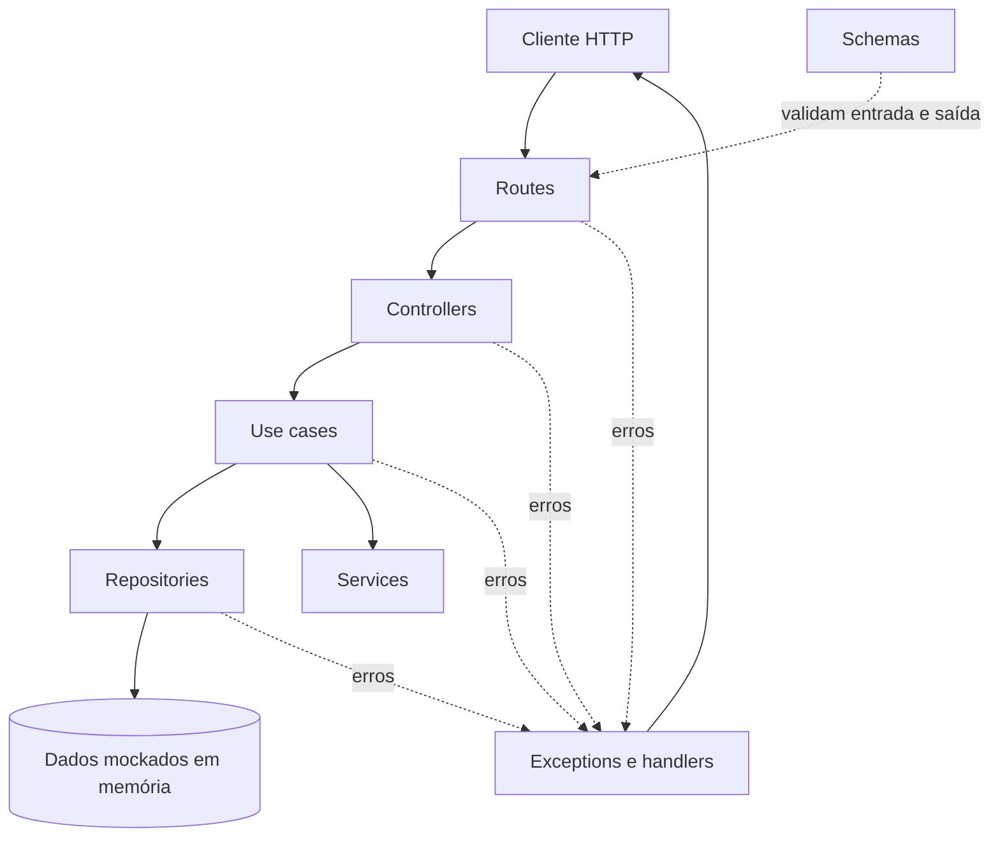
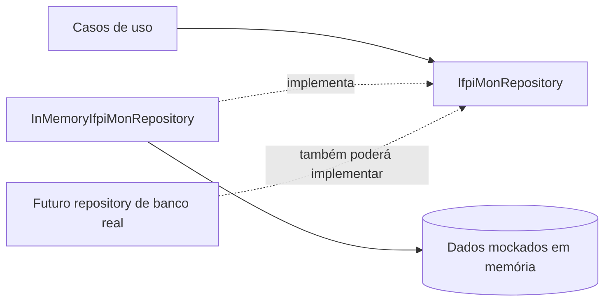
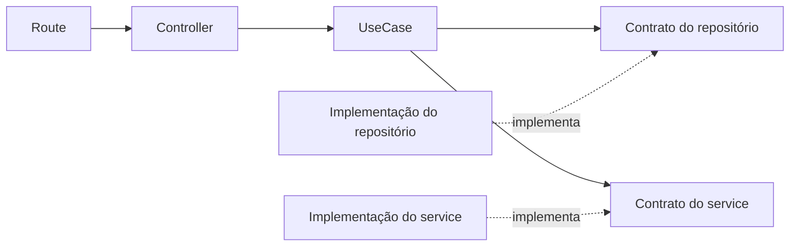
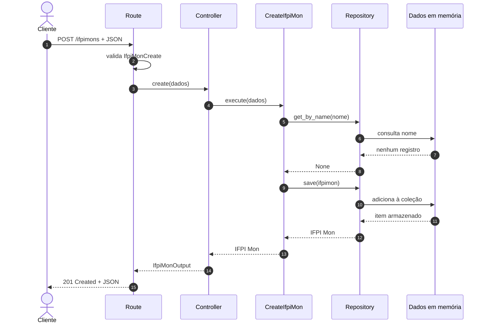
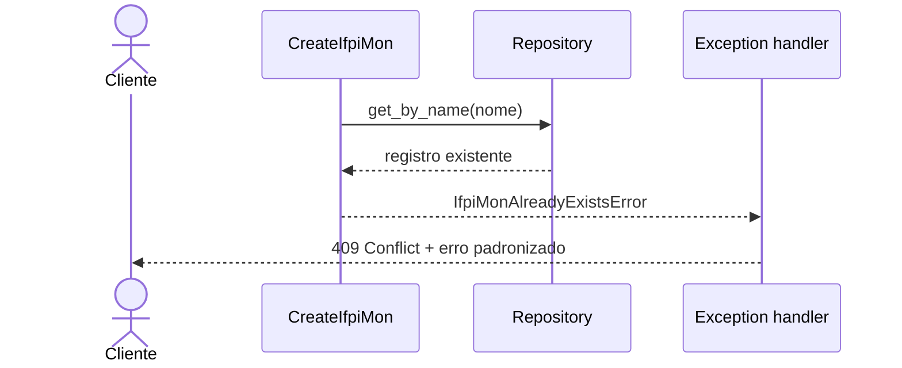

# Arquitetura da IFPI Mon API

Este documento define a arquitetura planejada da aplicação, as responsabilidades
de cada camada e as regras de comunicação entre elas. O funcionamento da API do
ponto de vista de uma requisição está descrito em
[Funcionamento da API](funcionamento.md).

> [!IMPORTANT]
> A estrutura abaixo é uma direção para o desenvolvimento. Como o projeto ainda
> está no início, os exemplos representam o desenho desejado e não afirmam que
> todas as funcionalidades já foram implementadas.

## 1. Objetivos da arquitetura

A separação em camadas procura:

- manter regras de negócio independentes do FastAPI e da forma de
  armazenamento;
- deixar claro onde cada tipo de código deve ser criado;
- facilitar testes isolados;
- permitir a troca de detalhes externos com impacto reduzido;
- evitar regras duplicadas em diferentes endpoints;
- tornar erros e respostas consistentes.

Separar camadas não significa criar arquivos sem necessidade. Cada arquivo deve
ter uma responsabilidade real e nomes que expressem sua finalidade.

## 2. Visão das camadas



O fluxo principal segue de fora para dentro. As camadas externas conhecem e
chamam as internas de que precisam. As regras de negócio não devem depender de
detalhes HTTP.

## 3. Estrutura sugerida

```text
api/
├── main.py
├── routes/
│   └── ifpimon_routes.py
├── controllers/
│   └── ifpimon_controller.py
├── usecases/
│   ├── create_ifpimon.py
│   └── get_ifpimon.py
├── services/
│   └── image_service.py
├── repositories/
│   ├── ifpimon_repository.py
│   └── implementations/
│       └── in_memory_ifpimon_repository.py
├── schemas/
│   └── ifpimon_schema.py
└── exceptions/
    ├── custom_exceptions.py
    └── handlers.py
```

Os nomes são exemplos. Novas pastas devem ser adicionadas apenas quando houver
uma responsabilidade que justifique sua existência.

### Decisão atual de armazenamento

O projeto começará com dados mockados em memória, sem conexão com um banco de
dados real. A implementação inicial será `InMemoryIfpiMonRepository`, enquanto
`IfpiMonRepository` definirá o contrato esperado pelos casos de uso.



A motivação do contrato não é a existência de vários bancos neste momento — a
única implementação inicial será em memória. Ele existe para impedir que as
regras da aplicação dependam diretamente de listas e para deixar preparada uma
futura mudança de armazenamento. Quando um banco real for adotado, routes,
controllers e casos de uso deverão continuar inalterados; a composição da
aplicação passará a fornecer a nova implementação.

## 4. Responsabilidade de cada camada

### 4.1 `main.py`

É o ponto de composição da aplicação. Deve:

- criar a instância do FastAPI;
- registrar os routers;
- registrar exception handlers;
- configurar middlewares;
- conectar as dependências principais da aplicação.

Não deve conter regras de negócio nem acessar diretamente os dados em memória
ou um futuro banco.

Exemplo simplificado:

```python
from fastapi import FastAPI

from api.exceptions.handlers import register_exception_handlers
from api.routes.ifpimon_routes import router as ifpimon_router

app = FastAPI(title="IFPI Mon API")
app.include_router(ifpimon_router)
register_exception_handlers(app)
```

### 4.2 Routes

As rotas representam a fronteira HTTP. São responsáveis por:

- declarar caminho e método HTTP;
- receber parâmetros, corpo e dependências;
- informar schemas e status de resposta;
- encaminhar os dados para o controller;
- retornar o resultado no contrato HTTP esperado.

Uma rota não deve consultar diretamente os dados em memória ou um futuro banco,
nem implementar decisões de negócio.

```python
@router.get("/{ifpimon_id}", response_model=IfpiMonOutput)
async def get_ifpimon(
    ifpimon_id: int,
    controller: IfpiMonController = Depends(get_ifpimon_controller),
) -> IfpiMonOutput:
    return await controller.get_by_id(ifpimon_id)
```

### 4.3 Controllers

O controller coordena a entrada recebida pela rota e a execução do caso de uso.
Ele pode:

- adaptar dados HTTP para os dados esperados pelo caso de uso;
- chamar o caso de uso correto;
- adaptar o resultado para o schema de saída;
- coordenar mais de uma operação de aplicação quando necessário.

O controller não deve conter a regra central do negócio. Se uma decisão precisa
ser verdadeira independentemente de HTTP, ela pertence ao caso de uso.

```python
class IfpiMonController:
    def __init__(self, get_ifpimon: GetIfpiMon):
        self.get_ifpimon = get_ifpimon

    async def get_by_id(self, ifpimon_id: int) -> IfpiMonOutput:
        entity = await self.get_ifpimon.execute(ifpimon_id)
        return IfpiMonOutput.model_validate(entity)
```

### 4.4 Use cases

Um caso de uso representa uma ação que o sistema oferece, como:

- cadastrar um IFPI Mon;
- buscar um IFPI Mon por identificador;
- listar IFPI Mons;
- atualizar um cadastro;
- remover um cadastro.

Ele concentra o fluxo e as regras da operação. Deve receber dependências por
construtor, trabalhar com abstrações e produzir um resultado que não dependa de
uma resposta HTTP.

```python
class GetIfpiMon:
    def __init__(self, repository: IfpiMonRepository):
        self.repository = repository

    async def execute(self, ifpimon_id: int) -> IfpiMon:
        ifpimon = await self.repository.get_by_id(ifpimon_id)
        if ifpimon is None:
            raise IfpiMonNotFoundError(ifpimon_id)
        return ifpimon
```

Observe que o caso de uso lança um erro da aplicação, mas não cria um
`HTTPException`. Assim, ele poderia ser reutilizado por uma tarefa em segundo
plano ou por outra interface além da API HTTP.

### 4.5 Services

Services encapsulam capacidades reutilizáveis ou integrações que não são a
persistência principal de uma entidade. Exemplos possíveis:

- armazenamento de imagens;
- envio de mensagens;
- geração de arquivos;
- consumo de uma API externa;
- cálculo complexo compartilhado por vários casos de uso.

Um service não deve virar um local genérico para toda regra. Se o código descreve
uma ação completa oferecida pela aplicação, provavelmente é um caso de uso. Se
descreve acesso persistente a dados, provavelmente é um repositório.

### 4.6 Repositories

Repositories escondem os detalhes de acesso e armazenamento dos dados. Devem:

- disponibilizar operações necessárias aos casos de uso;
- devolver objetos utilizados pela aplicação sem expor detalhes internos da
  implementação;
- isolar o uso da coleção em memória e, futuramente, da tecnologia de banco;
- permitir que a implementação seja trocada sem alterar os casos de uso.

A abstração pode declarar o contrato:

```python
from typing import Protocol


class IfpiMonRepository(Protocol):
    async def get_by_id(self, ifpimon_id: int) -> IfpiMon | None: ...
    async def save(self, ifpimon: IfpiMon) -> IfpiMon: ...
```

A implementação inicial utiliza uma coleção em memória carregada com dados
mockados. No futuro, outra implementação poderá usar SQLAlchemy, MongoDB ou
outra tecnologia, desde que cumpra o mesmo contrato. O repositório não decide
qual status HTTP deve ser devolvido.

Um exemplo simplificado da implementação inicial:

```python
class InMemoryIfpiMonRepository:
    def __init__(self, initial_data: list[IfpiMon] | None = None) -> None:
        self._ifpimons = list(initial_data or [])

    async def get_by_id(self, ifpimon_id: int) -> IfpiMon | None:
        return next(
            (
                ifpimon
                for ifpimon in self._ifpimons
                if ifpimon.id == ifpimon_id
            ),
            None,
        )

    async def save(self, ifpimon: IfpiMon) -> IfpiMon:
        self._ifpimons.append(ifpimon)
        return ifpimon
```

Essa instância deve ser criada uma única vez na composição da aplicação e
reutilizada entre as requisições. Criar um repository novo para cada requisição
apagaria as alterações anteriores. Mesmo quando reutilizados, os dados são
voláteis: reiniciar a aplicação restaura o conjunto mockado original.

### 4.7 Schemas

Schemas definem o contrato de dados da API e realizam a validação estrutural.
É recomendado separar modelos conforme sua finalidade:

- `IfpiMonCreate`: campos aceitos no cadastro;
- `IfpiMonUpdate`: campos aceitos na alteração;
- `IfpiMonOutput`: campos devolvidos ao cliente;
- `ErrorOutput`: formato padronizado dos erros.

Não se deve reutilizar automaticamente um único schema em todas as operações.
Por exemplo, o identificador pode existir na saída, mas não deve ser informado
pelo cliente durante a criação.

```python
from pydantic import BaseModel, ConfigDict


class IfpiMonCreate(BaseModel):
    nome: str
    tipo: str


class IfpiMonOutput(BaseModel):
    model_config = ConfigDict(from_attributes=True)

    id: int
    nome: str
    tipo: str
```

### 4.8 Exceptions

A pasta `exceptions` centraliza os erros conhecidos da aplicação e sua tradução
para HTTP.

- `custom_exceptions.py` declara exceções com significado para o negócio;
- `handlers.py` converte cada exceção em status e corpo de resposta;
- erros inesperados podem ser registrados e retornar uma mensagem segura.

```python
class IfpiMonNotFoundError(Exception):
    def __init__(self, ifpimon_id: int):
        self.ifpimon_id = ifpimon_id
        super().__init__(f"IFPI Mon {ifpimon_id} não encontrado")
```

```python
async def ifpimon_not_found_handler(
    request: Request,
    exc: IfpiMonNotFoundError,
) -> JSONResponse:
    return JSONResponse(
        status_code=404,
        content={
            "error": "ifpimon_not_found",
            "message": (
                f"IFPI Mon de identificador {exc.ifpimon_id} "
                "não foi encontrado."
            ),
        },
    )
```

Separar a exceção do handler preserva duas responsabilidades: o caso de uso
informa **o que deu errado** e a camada HTTP decide **como representar o erro**.

## 5. Diferenças que evitam confusão

| Camada | Pergunta respondida | Não deve decidir |
|---|---|---|
| Route | Qual endpoint recebe a requisição? | Regra de negócio |
| Controller | Como coordenar entrada e saída? | Como persistir dados |
| Use case | Qual ação e quais regras executar? | Status ou resposta HTTP |
| Service | Qual capacidade externa ou compartilhada usar? | Fluxo completo de toda operação |
| Repository | Como acessar os dados? | Regra de apresentação |
| Schema | Qual é o formato dos dados? | Persistência ou fluxo de negócio |
| Exception handler | Como um erro vira resposta HTTP? | A regra que provocou o erro |

## 6. Regras de dependência

As dependências devem apontar para o núcleo da aplicação, nunca para detalhes
desnecessários das camadas externas.



Regras práticas:

1. uma rota pode depender de controller e schemas;
2. um controller pode depender de casos de uso e schemas;
3. um caso de uso pode depender de contratos de repositories e services;
4. um repositório não deve importar routes ou controllers;
5. um caso de uso não deve importar FastAPI;
6. detalhes do armazenamento em memória, de um futuro banco e de serviços
   externos devem ficar nas implementações;
7. as dependências concretas devem ser conectadas na composição da aplicação.

## 7. Caso de uso completo: cadastrar um IFPI Mon

Este exemplo demonstra como as camadas colaboram sem misturar responsabilidades.



### Caminho alternativo: nome duplicado

Se nomes duplicados não forem permitidos, o fluxo muda depois da consulta:



O repositório apenas informa que encontrou um registro. A decisão de impedir o
cadastro pertence ao caso de uso. O handler apenas traduz a decisão para HTTP.

## 8. Injeção de dependências

Casos de uso não devem criar suas próprias dependências concretas:

```python
# Evitar: o caso de uso fica preso ao armazenamento em memória.
class GetIfpiMon:
    def __init__(self):
        self.repository = InMemoryIfpiMonRepository()
```

Prefira receber a dependência:

```python
class GetIfpiMon:
    def __init__(self, repository: IfpiMonRepository):
        self.repository = repository
```

Inicialmente, a composição da aplicação fornece uma única instância de
`InMemoryIfpiMonRepository`, carregada com os mocks. Quando houver um banco real,
somente essa composição será alterada para fornecer a nova implementação.

## 9. Estratégia de testes

A separação permite testar cada responsabilidade:

- **use cases:** testes unitários com repositories e services falsos;
- **repository em memória:** testes das consultas e alterações na coleção;
- **futuros repositories:** testes de integração com a fonte de dados real;
- **routes:** testes do contrato HTTP, validação e status;
- **handlers:** testes do status e do corpo de cada erro;
- **fluxos completos:** poucos testes de ponta a ponta para operações críticas.

Um teste de caso de uso não precisa iniciar o FastAPI nem acessar um banco real.
Isso o torna mais rápido e ajuda a localizar falhas.

## 10. Como adicionar uma funcionalidade

Ao implementar uma nova operação:

1. defina claramente a entrada, a saída e as regras;
2. crie ou ajuste os schemas necessários;
3. declare as operações de repositório ou service exigidas;
4. implemente o caso de uso;
5. crie o controller que coordena a operação;
6. exponha a rota e documente seus possíveis status;
7. adicione exceções e handlers para erros conhecidos;
8. conecte as dependências no ponto de composição;
9. escreva testes proporcionais à responsabilidade alterada;
10. atualize a documentação quando o contrato mudar.

## 11. Critério para decidir onde colocar um código

Quando houver dúvida, use estas perguntas:

- trata de URL, cabeçalho ou status? **Route ou exception handler**;
- coordena a entrada e a saída de uma ação? **Controller**;
- expressa uma regra ou ação do sistema? **Use case**;
- oferece uma capacidade externa ou reutilizável? **Service**;
- consulta ou persiste dados? **Repository**;
- define formato e validação de dados? **Schema**;
- representa uma falha conhecida? **Exception**.

Se um arquivo começar a responder várias dessas perguntas ao mesmo tempo, ele
provavelmente está acumulando responsabilidades e deve ser reorganizado.
