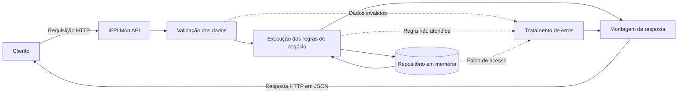
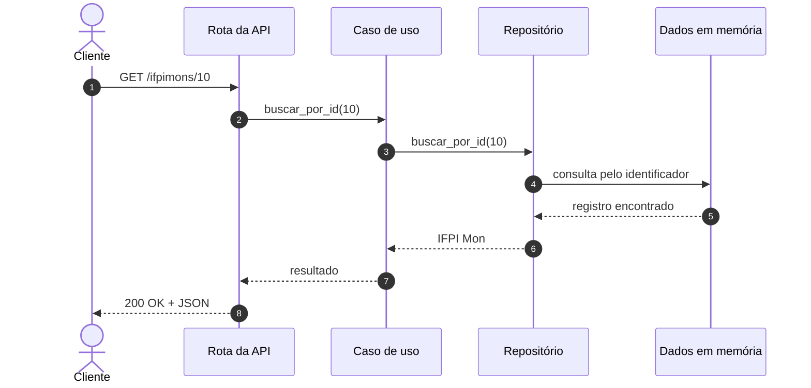
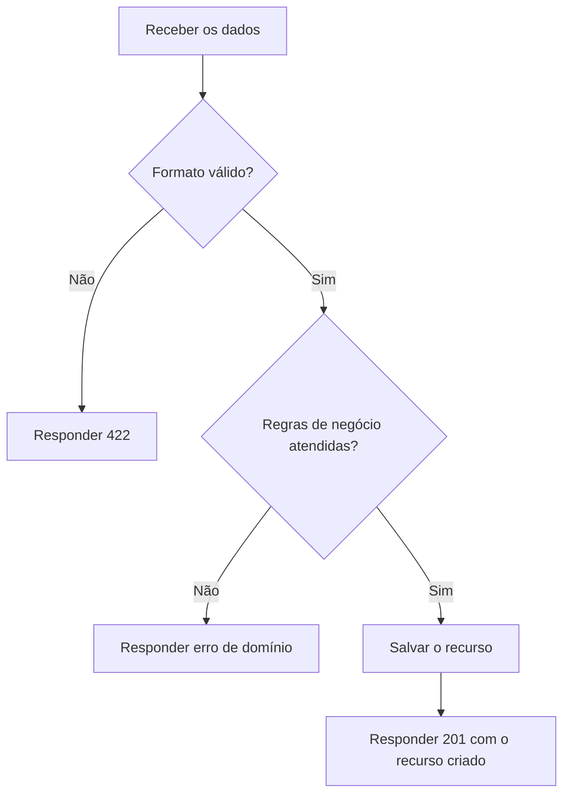
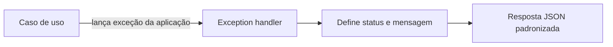

# Funcionamento da API

Este documento apresenta o funcionamento esperado da IFPI Mon API do ponto de
vista de quem envia uma requisição. Para conhecer a organização interna do
código e a responsabilidade de cada camada, consulte a
[documentação de arquitetura](arquitetura.md).

> [!NOTE]
> O projeto ainda está em sua estrutura inicial. As rotas e os dados mostrados
> aqui são exemplos que orientam a implementação e podem mudar durante o
> desenvolvimento.

## 1. O que é uma API?

Uma API permite que sistemas diferentes se comuniquem por meio de contratos.
Na IFPI Mon API, um cliente — navegador, aplicativo ou outra API — envia uma
requisição HTTP e recebe uma resposta HTTP, normalmente representada em JSON.

Cada requisição informa:

- **método HTTP:** qual operação deve ser realizada;
- **endereço:** qual recurso será acessado;
- **parâmetros:** informações presentes na URL ou na consulta;
- **cabeçalhos:** metadados, como o tipo do conteúdo e autenticação;
- **corpo:** dados enviados para criar ou alterar um recurso.

Uma resposta contém:

- **status HTTP:** informa se a operação funcionou;
- **cabeçalhos:** metadados da resposta;
- **corpo:** resultado da operação ou detalhes do erro.

## 2. Visão geral

O fluxo começa quando o cliente envia uma requisição e termina quando recebe
uma resposta. Internamente, a requisição atravessa camadas com responsabilidades
específicas.



### Armazenamento inicial

Na primeira versão, a API não utilizará um banco de dados externo. Os IFPI Mons
serão fornecidos como dados mockados e mantidos por um repositório em memória.
Isso significa que:

- não será necessário instalar ou configurar um servidor de banco de dados;
- leituras e alterações serão feitas em uma coleção mantida pela aplicação;
- os dados existirão somente enquanto a aplicação estiver em execução;
- ao reiniciar a aplicação, os dados voltarão ao estado mockado inicial;
- essa implementação não é indicada para armazenar dados definitivos em
  produção.

A API acessará esses dados por meio de um contrato de repository. Por isso, o
funcionamento das rotas e dos casos de uso não ficará preso ao armazenamento em
memória. No futuro, será possível criar uma implementação para um banco real e
trocar apenas a configuração responsável por montar a aplicação.

## 3. Métodos HTTP

Os métodos indicam a intenção da operação:

| Método | Finalidade | Exemplo ilustrativo |
|---|---|---|
| `GET` | Consultar recursos | Listar IFPI Mons |
| `POST` | Criar um recurso | Cadastrar um IFPI Mon |
| `PUT` | Substituir um recurso | Atualizar todos os seus dados |
| `PATCH` | Alterar parte de um recurso | Alterar apenas seu nome |
| `DELETE` | Remover um recurso | Excluir um IFPI Mon |

O método faz parte do contrato. Por exemplo, consultar um recurso não deve
alterar dados, enquanto uma exclusão não deve ser realizada por `GET`.

## 4. Caminho de uma requisição

Considere, como exemplo, uma futura consulta `GET /ifpimons/10`.

1. O cliente envia a requisição para buscar o IFPI Mon de identificador `10`.
2. A aplicação identifica a rota correspondente.
3. Os parâmetros recebidos são validados.
4. O caso de uso de busca é executado.
5. O repositório consulta os dados mockados mantidos em memória.
6. Se o registro existir, a API monta a representação de saída.
7. A API responde com o status `200 OK` e os dados em JSON.
8. Se o registro não existir, o erro da aplicação é convertido em `404 Not
   Found`.



### Exemplo de resposta bem-sucedida

O formato abaixo é ilustrativo:

```json
{
  "id": 10,
  "nome": "Exemplo Mon",
  "tipo": "tecnologia"
}
```

## 5. Exemplo de criação

Em uma futura rota `POST /ifpimons`, o cliente enviaria os dados necessários no
corpo da requisição:

```json
{
  "nome": "Exemplo Mon",
  "tipo": "tecnologia"
}
```

O fluxo esperado seria:



É importante diferenciar as duas validações:

- a **validação de entrada** verifica formato, tipo e campos obrigatórios;
- a **validação de negócio** verifica regras próprias do projeto, como a
  impossibilidade de cadastrar um nome duplicado, caso essa regra seja adotada.

## 6. Códigos de resposta

A API deve utilizar códigos HTTP de maneira consistente:

| Código | Significado | Quando utilizar |
|---|---|---|
| `200 OK` | Operação concluída | Consultas e atualizações com resposta |
| `201 Created` | Recurso criado | Cadastro concluído |
| `204 No Content` | Sucesso sem corpo | Exclusão concluída |
| `400 Bad Request` | Requisição inválida | Regra geral da requisição não atendida |
| `404 Not Found` | Recurso inexistente | Identificador não encontrado |
| `409 Conflict` | Conflito com o estado atual | Cadastro duplicado, quando não permitido |
| `422 Unprocessable Content` | Dados não validáveis | Campo obrigatório ausente ou tipo inválido |
| `500 Internal Server Error` | Erro inesperado | Falha não prevista pela aplicação |

O corpo de erro deve seguir um formato único. Um exemplo possível é:

```json
{
  "error": "ifpimon_not_found",
  "message": "IFPI Mon de identificador 10 não foi encontrado."
}
```

O campo `error` é estável e pode ser interpretado por outros sistemas. O campo
`message` apresenta uma explicação legível para uma pessoa.

## 7. Tratamento de erros

Erros esperados não devem ser tratados como falhas desconhecidas. A aplicação
deve definir exceções próprias, como `IfpiMonNotFoundError`, e registrá-las em
handlers centralizados.



Esse mecanismo evita a repetição de blocos `try/except` nas rotas e garante que
o mesmo erro sempre produza o mesmo código e formato de resposta. Erros internos
não devem expor rastreamentos, consultas ou informações sensíveis ao cliente.

## 8. Documentação interativa

Ao criar a aplicação com FastAPI, os schemas, parâmetros, respostas e descrições
das rotas podem gerar documentação OpenAPI automaticamente. Durante o
desenvolvimento, os endereços normalmente utilizados são:

- `/docs` para a interface Swagger UI;
- `/redoc` para a interface ReDoc;
- `/openapi.json` para o contrato OpenAPI em JSON.

Essas páginas ajudam a experimentar endpoints, mas não substituem esta
documentação: elas descrevem o contrato técnico atual, enquanto estes arquivos
registram decisões, responsabilidades e fluxos do projeto.

## 9. Resumo do funcionamento

Uma operação completa deve:

1. receber a requisição;
2. reconhecer a rota;
3. validar os dados de entrada;
4. executar um caso de uso;
5. consultar ou alterar dados por meio de um repositório;
6. converter o resultado para um schema de saída;
7. devolver o status HTTP apropriado;
8. transformar erros conhecidos em respostas padronizadas.

Esse fluxo mantém o comportamento da API previsível para quem a utiliza e
permite que sua implementação evolua sem misturar as responsabilidades internas.
