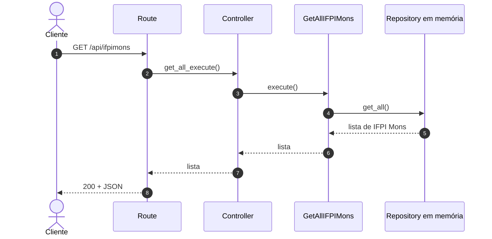
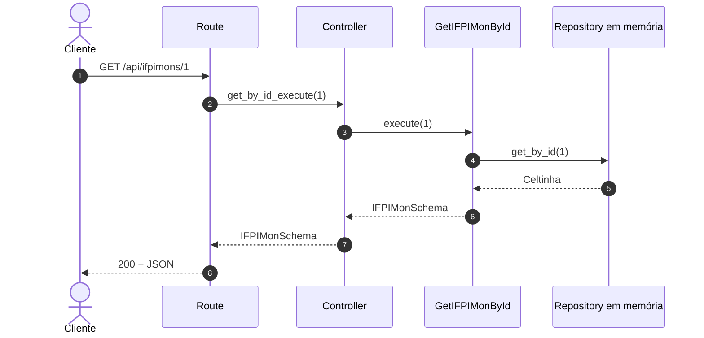
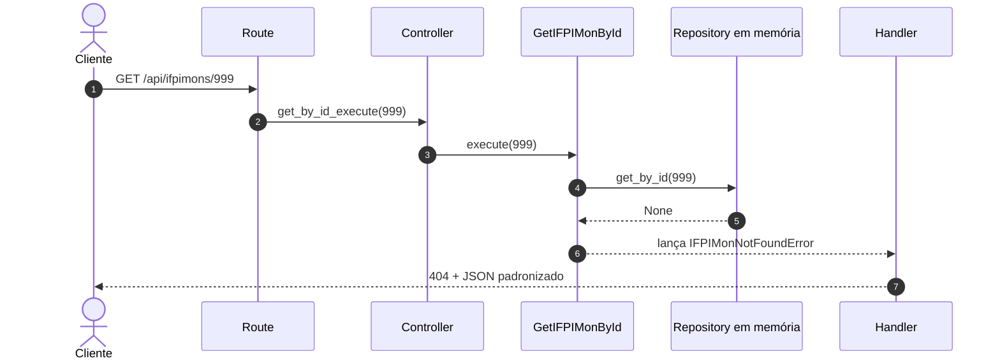

# Funcionamento atual da IFPI Mon API

Este documento apresenta como executar e consumir as funcionalidades que já
existem no projeto. A organização interna está detalhada em
[Arquitetura atual da API](arquitetura.md).

## Executar o projeto

Na raiz do repositório, instale as dependências:

```bash
uv sync
```

Inicie o servidor de desenvolvimento:

```bash
uv run fastapi dev api/main.py
```

Por padrão, o servidor fica disponível em:

```text
http://127.0.0.1:8000
```

## Endpoints disponíveis

| Método | Caminho | Resultado |
|---|---|---|
| `GET` | `/` | Informações básicas da API |
| `GET` | `/api/ifpimons` | Lista todos os IFPI Mons |
| `GET` | `/api/ifpimons/{ifpimon_id}` | Busca um IFPI Mon pelo ID |
| `GET` | `/docs` | Interface Swagger UI gerada pelo FastAPI |
| `GET` | `/redoc` | Interface ReDoc gerada pelo FastAPI |
| `GET` | `/openapi.json` | Contrato OpenAPI da aplicação |

Não existem endpoints `POST`, `PUT`, `PATCH` ou `DELETE` nesta versão.

## Rota raiz

Requisição:

```http
GET /
```

Resposta atual:

```json
{
  "name": "IFPIMon API",
  "docs": "/docs",
  "ifpimons": "/api/ifpimons",
  "ifpimon_by_id": "/api/ifpimons/1"
}
```

As operações de IFPI Mon usam o prefixo real `/api/ifpimons`.

## Listar todos os IFPI Mons

Requisição:

```http
GET /api/ifpimons
```

Resposta atual:

```http
200 OK
```

```json
[
  {
    "id": 1,
    "nome": "Celtinha",
    "tipo": "Metal",
    "treinador": "Vitor"
  }
]
```

O fluxo interno é:



Se a lista em memória estiver vazia, a resposta será:

```json
[]
```

## Buscar um IFPI Mon existente

Requisição:

```http
GET /api/ifpimons/1
```

Resposta:

```http
200 OK
```

```json
{
  "id": 1,
  "nome": "Celtinha",
  "tipo": "Metal",
  "treinador": "Vitor"
}
```

O valor `1` é convertido pelo FastAPI para `int` e entregue à função da route.
Depois, route, controller e use case repassam o mesmo ID até o repository.



## Buscar um ID inexistente

Requisição:

```http
GET /api/ifpimons/999
```

Resposta:

```http
404 Not Found
```

```json
{
  "error": "ifpimon_not_found",
  "message": "IFPI Mon com ID 999 não foi encontrado."
}
```

O repository devolve `None`, e o use case transforma essa ausência em
`IFPIMonNotFoundError`. O FastAPI encontra o handler registrado e devolve a
resposta HTTP.



Não há `try/except` nesse fluxo. O mecanismo de exception handlers do FastAPI
realiza o encaminhamento automaticamente.

## Enviar um ID inválido

Requisição:

```http
GET /api/ifpimons/abc
```

A função da route declara `ifpimon_id: int`. Como `abc` não pode ser convertido
para inteiro, o FastAPI rejeita a requisição antes de chamar o controller e
responde com:

```http
422 Unprocessable Content
```

Esse erro utiliza atualmente o formato padrão de validação do FastAPI.

## Modelo de dados

Todo IFPI Mon possui:

| Campo | Tipo | Obrigatório |
|---|---|---|
| `id` | inteiro | Sim |
| `nome` | texto | Sim |
| `tipo` | texto | Sim |
| `treinador` | texto ou `null` | Não |

Representação JSON:

```json
{
  "id": 1,
  "nome": "Celtinha",
  "tipo": "Metal",
  "treinador": "Vitor"
}
```

## Armazenamento em memória

A API não está conectada a um banco de dados. Uma instância de
`InMemoryIFPIMonRepository` é criada em `dependencies.py` e contém uma lista de
objetos `IFPIMonSchema`.

Consequências:

- não é necessário configurar um banco;
- a leitura é realizada diretamente na lista;
- alterações futuras existiriam somente durante a execução;
- reiniciar o servidor restaura os dados definidos no código;
- o contrato `IFPIMonRepository` permite substituir essa implementação no
  futuro.

## Testar pelo Swagger

Com o servidor em execução, acesse:

```text
http://127.0.0.1:8000/docs
```

Na interface:

1. abra uma operação de IFPI Mons;
2. selecione **Try it out**;
3. informe o ID quando necessário;
4. selecione **Execute**;
5. confira o status e o corpo da resposta.

## Resumo dos resultados testados

| Requisição | Status atual | Resultado |
|---|---:|---|
| `GET /` | 200 | Informações da API |
| `GET /api/ifpimons` | 200 | Lista contendo Celtinha |
| `GET /api/ifpimons/1` | 200 | Dados de Celtinha |
| `GET /api/ifpimons/999` | 404 | Erro `ifpimon_not_found` |
| `GET /api/ifpimons/abc` | 422 | Erro padrão de validação |

Esses resultados foram verificados contra a implementação atual.
